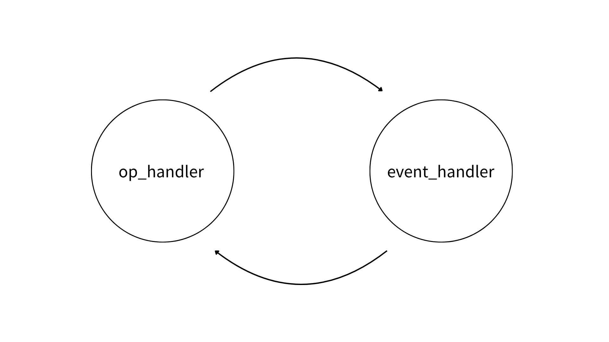
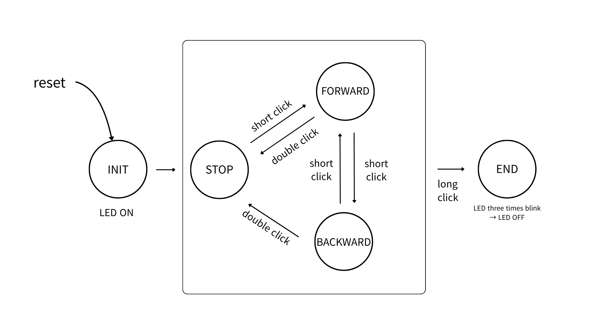

   

# 모터 제어 프로젝트

## 상위설계서

 

**High-Level Design Document**

     
| | |
|---|---|
| **버전** | v2.3 |
| **작성자** | 권민지 박수민 현수근 |
| **작성일** | 2026-07-24 |
| **팀** | AI시스템반도체SW개발_2기_4팀 |
| **git** | https://github.com/clap-min99/motor_control |

## 목차

1. State

    1.1 Operation Diagram

    1.2 State Diagram

2. Peripheral
3. Function

---

### 모터 제어 프로젝트 상위설계서
### 1.State
  - #### 1.1 Operation Diagram
    - #### 1.1.1 Operation
        

        | op_handler | event_handler |
        |---------------------|---------------------|
        | <b>gear_set</b><ul><li>gear default: 50 + 5 × n (n = 1~9)</li></ul><b>motor_state_set</b><ul><li>state_set: stop, forward, end<ul><li>one_clk: CW (default), CCW</li><li>double_clk: STOP (prv_motor_state)</li><li>long_clk: END (set default)</li></ul></li></ul> |<b>uart</b><ul><li>n (n = gear)</li></ul><b>key_handle</b><ul><li>set Key_Pressed</li></ul><b>TIMER_Event</b><ul><li>TIMER2 cnt</li><li>TIMER5 cnt</li><li>TIMER3 Delay</li></ul> | 

  - #### 1.2 State Diagram
    
    - #### 1.2.1 State
        
  
        | **STATE** | **DESCRIPTION** | **EVENT** |
        |---|---|---|
        | **INIT** |주변장치 정의 및 LED ON|reset 시 진입 -> motor_state : 2| 
        | **STOP** |모터 정지| motor_state : 2(정지)|
        | **FOWARD** |모터 정방향 회전(A1:0, A0:1)|motor_state : 0 (정회전)|
        | **BACKWARD** |모터 역방향 회전(A1: 1, A0: 0)|motor_state : 1 (역회전)|
        | **END** |LED 3번 깜빡임 후 OFF|motor_state: 3 (종료)|
        | **SPEED_CTRL** |UART로 속도 변환|Uart_Data_In=1 일 때|

### 2.Peripheral
  
  | **PERIPHERAL** | **PIN** | **DESCRIPTION** | **PIN** | **INTERRUPT** |
  |------------|-----|:------------:|:-----------:|:---------:|
  | GPIO | GPIOA | - | A5 : LED | - |
  | GPIO | GPIOC | - | C13 : BUTTON | IRQ40 |
  | TIMER | TIMER2 | 버튼 3초 체크 (falling edge 체크) | X | IRQ28 |
  | TIMER | TIMER3 | delay(int time) | X | X |
  | TIMER | TIMER5 | 모터 속도 제어 (PWM) | A0(A1) : MOTOR A0 : CCR Ch1 A1 : CCR Ch2 | X |
  | UART | UART2 | 속도 제어 (PWM) | A2, A3 | IRQ38 |

### 3. Function
  - #### 3.1 main.c

    | **FUNCTION NAME** | **PARAMETER** | **RETURN VALUE** | **DESCRIPTION** |
    |:----------:|:---:|:-----------:|:-----------:|
    | SysInit | void | int baud | - | 
    | Main | void | void | - |

  - #### 3.2 timer.c

    | **FUNCTION NAME** | **PARAMETER** | **RETURN VALUE** | **DESCRIPTION** |
    |:----------:|:---:|:-----------:|:-----------:|
    | SysInit | void | int baud | - | 
    | Main | void | void | - |

  - #### 3.3 key.c

    | **FUNCTION NAME** | **PARAMETER** | **RETURN VALUE** | **DESCRIPTION** |
    |:----------:|:---------:|:-----------:|:----------:|
    | TIM2_ISR_EN | void | void | button check | 
    | TIM3_Delay | int time | void | time만큼 Delay(ms) |
    | TIM5_Init | void | void | pwm 설정 |
    | TIM5_CW_PWM | unsigned short freq int duty | void | - |
    | TIM5_CWW_PWM|unsigned short freq int duty | void | - | - |
  
  - #### 3.4 uart.c

    | **FUNCTION NAME** | **PARAMETER** | **RETURN VALUE** | **DESCRIPTION** |
    |:----------:|:---:|:----------:|:-----------:|
    | Uart2_Init | int baud | void | - | 
    | Uart2_Send_Byte | char data | void | - |
    | Uart2_Get_Char | void | void | - |
    | Uart2_RX_Interrupt_Enable | int en | void | - |

  - #### 3.5 motor.c

    | **FUNCTION NAME** | **PARAMETER** | **RETURN VALUE** | **DESCRIPTION** |
    |:----------:|:---:|:-----------:|:-----------:|
    | Motor_CW | int gear | void | 정회전 pwm으로 속도제어 | 
    | Motor_CCW | int gear | void | 역회전 pwm으로 속도제어 |
    | Motor_Stop | void | void | - |

  - #### 3.6 led.c

    | **FUNCTION NAME** | **PARAMETER** | **RETURN VALUE** | **DESCRIPTION** |
    |:----------:|:---:|:-----------:|:-----------:|
    | LED_Init | void | void | - | 
    | LED_On | void | void | LD2 On |
    | LED_On | void | void | LD2 Off |

  - #### 3.7 operation.c

    | **FUNCTION NAME** | **PARAMETER** | **RETURN VALUE** | **DESCRIPTION** |
    |:----------:|:---:|:-----------:|:-----------:|
    | Op_Handler | void | void | - |
    | Key_Handler | unsigned int time_cnt | key 눌렀을 때 동작 |
    | Uart_Handler | void | void | uart data 받을 때 동작 |

### 4. 변수

  - #### 4-1. 전역변수
 
    | GLOBAL | data type | DESCRIPTION |
    |:----------:|:-----------:|:-----------:|
    | motor_state | volatile unsigned int | 동작 상태 |
    | motor_dir | volatile unsigned int | 모터 방향(0: 정회전, 1: 역회전) |
    | time_cnt | volatile unsigned int | time | 
    | Uart_data_in| volatile unsigned int|uart 데이터 입력 체크| 
    |motor_speed|volatile int| |
    |gear|volatile unsigned int|PWM 속도 전달|
    |Key_Pressed| volatile unsigned int| 0:X, 1:key press, 2:key release|